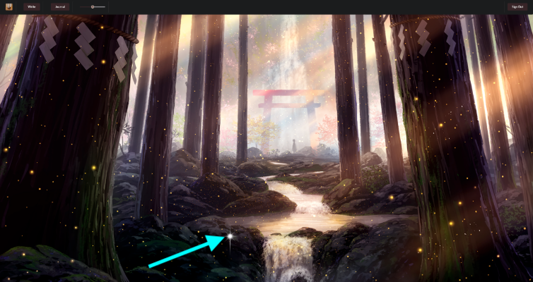

# Kind Words App - Front End

### Abstract

A simple app that is meant to spread positivity by sharing some kind words.

This is our Module Four group project for Flatiron. It is a single page web application built with a ReactJS front end, and a [Rails API back end](https://github.com/kara-o/KindWordsBackEnd).

### How to Run

Please install our [Rails back end](https://github.com/kara-o/KindWordsBackEnd) as well.

In your terminal navigate to the directory where you want to save the front end game files, then enter and run each step:

1. `git clone git@github.com:kara-o/KindWordsFrontEnd.git`
1. `cd KindWordsFrontEnd`
1. `npm install`
1. `npm start`

### Additional Contributors

- [Justin](https://github.com/justinamaple)
- [Brian](https://github.com/brianly27)

### Screenshots

 
<em>Login</em>

 
<em>Home screen (added arrow for readme image to show moving fairy)

 
<em>A view of the opened letter after you click on a fairy</em>

 
<em>Responding to a letter</em>

 
<em>Review all of your posted letters and their responses from others</em>

